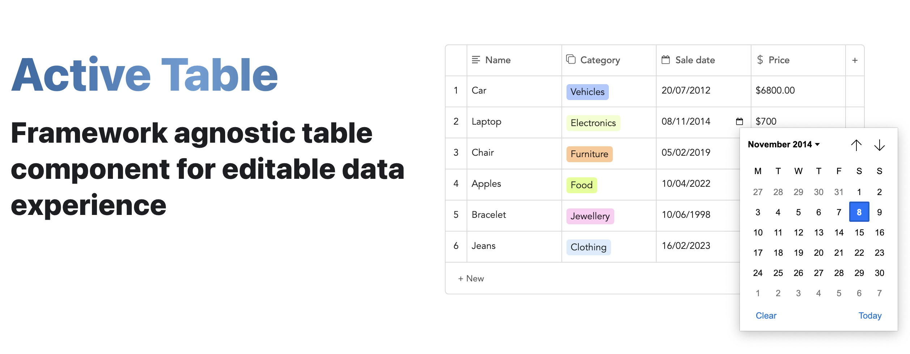

<br />



<b>Active Table</b> is a fully customizable UI component built with a focus on delivering the best editable table experience possible. Whether you need a simple table or a complex real-time data visualization grid, this component can be tailored to suit your specific needs! Explore [activetable.io](https://activetable.io/) to view all of the available features, how to use them, examples and more!

### :rocket: Main Features

- Add/Remove/Move rows/columns
- Max rows/columns
- Index column
- Resizable column widths
- Striped rows
- Sorting
- Text validation
- Column types: Text/Number/Currency/Select/Label/Date/Checkbox
- API for building custom column types
- Programmatic cell updates
- Pagination
- Overflow scrollbar
- Import/Export/Paste from CSV
- Everything is customizable

### :computer: Getting started

```
npm install active-table
```

If using React, install the following instead:

```
npm install active-table-react
```

Then simply add this to your markup:

```
<active-table content='[["Planet"],["Earth"]]'/>
```

The exact syntax for the above example will vary depending on the framework of your choice ([see here](https://activetable.io/docs/examples)).

### :dart: Roadmap

- [ ] Code refactoring (<b>In Progress</b>)
- [ ] Move row/column by dragging
- [ ] Pick mode
- [ ] Data filtering
- [ ] Unit tests
- [ ] Undo/Redo

## :heart: Contributions

Open source is built by the community for the community. All contributions to this project are welcome!
<br> Additionally, if you have any suggestions for enhancements, ideas on how to take the project further or have discovered a bug, do not hesitate to create a new issue ticket and we will look into it as soon as possible!
