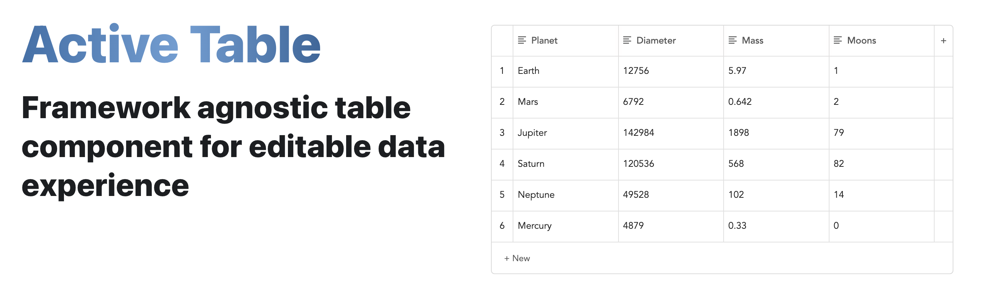

<b>Active Table</b> is a UI component built with a focus on delivering the best editable table experience possible.

Please use activetable.io to browse all the available features, how to use them, examples and more!

### Main Features

- Add/Remove/Move rows/columns
- Max rows/columns
- Index column
- Resizable column widths
- Text validation
- Reactive cell styling
- Sorting
- Paste from CSV
- Column types: Text/Number/Currency/Select/Label/Date/Checkbox
- API for building custom column types
- Programmatic cell updates
- Scrollbar for overflow
- Pagination
- Striped rows
- Editable styling

### Setup

```
npm install active-table
```

Install the following package for React instead:

```
npm install active-table-react
```

### How to use

Simply add this to your markup:

```
<active-table content='[["Planet"],["Earth"]]'/>
```

The exact syntax for the above example will vary depending on the framework of your choice (See here).
