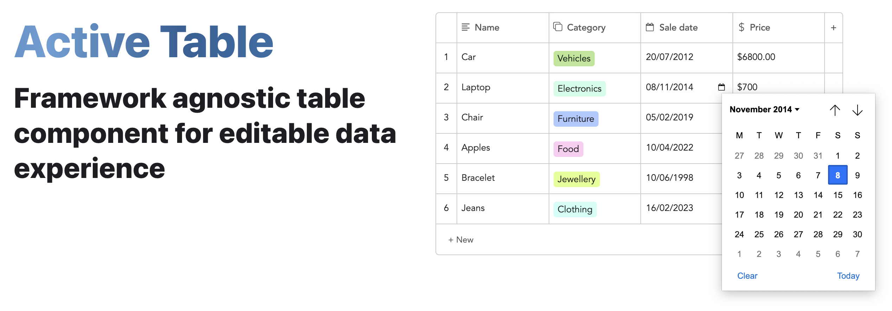

<br />



<b>Active Table</b> is a UI component built with a focus on delivering the best editable table experience. With customizable features, you can easily tailor it to meet your specific design requirements. Use activetable.io to browse all the available features, how to use them, examples and more!

### Main Features

- Add/Remove/Move rows/columns
- Max rows/columns
- Index column
- Resizable column widths
- Text validation
- Reactive cell styling
- Sorting
- Column types: Text/Number/Currency/Select/Label/Date/Checkbox
- API for building custom column types
- Paste from CSV
- Programmatic cell updates
- Overflow scrollbar
- Pagination
- Striped rows
- Customization styling

### Get started

```
npm install active-table
```

Use the following package for React instead:

```
npm install active-table-react
```

Then simply add this to your markup:

```
<active-table content='[["Planet"],["Earth"]]'/>
```

The exact syntax for the above will vary depending on the framework of your choice (see here).

### Todo

- [ ] Code refactoring (<b>In Progress</b>)
- [ ] Move row/column by dragging
- [ ] Selection mode
- [ ] Data filtering
- [ ] Unit tests
- [ ] Undo/Redo

## Contributions

Open source is built by the community for the community. All contributions to this project are welcome!
<br> Additionally, if you have any suggestions for enhancements, ideas on how to take the project further or have discovered a bug, do not hesitate to create a new issue ticket and we will look into it as soon as possible!
