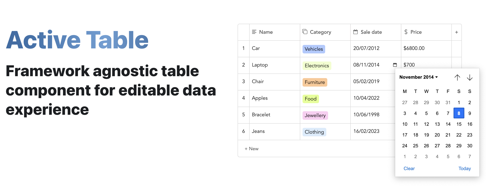

<br />



<b>Active Table</b> is a fully customizable UI component built with a focus on delivering the best editable table experience possible. Please use [activetable.io](https://activetable.io/) to view all the available features, how to use them, examples and more!

The documentation website has been built using [Docusaurus 2](https://docusaurus.io/).

## :construction_worker: Local setup

```
# Install node dependencies:
$ npm install

# build the website:
$ npm run build

# serve and automatically build the website:
$ npm run start
```

## :heart: Contributions

Open source is built by the community for the community. All contributions to this project are welcome!
<br> Additionally, if you have any suggestions for enhancements, ideas on how to take the project further or have discovered a bug, do not hesitate to create a new issue ticket and we will look into it as soon as possible!
